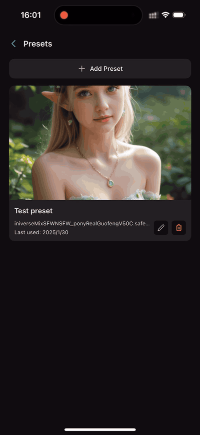
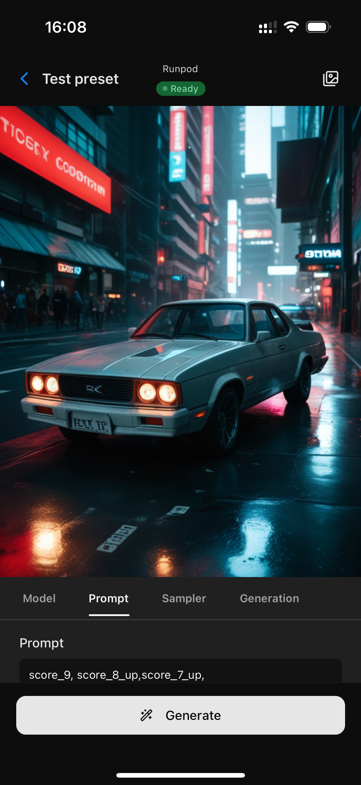
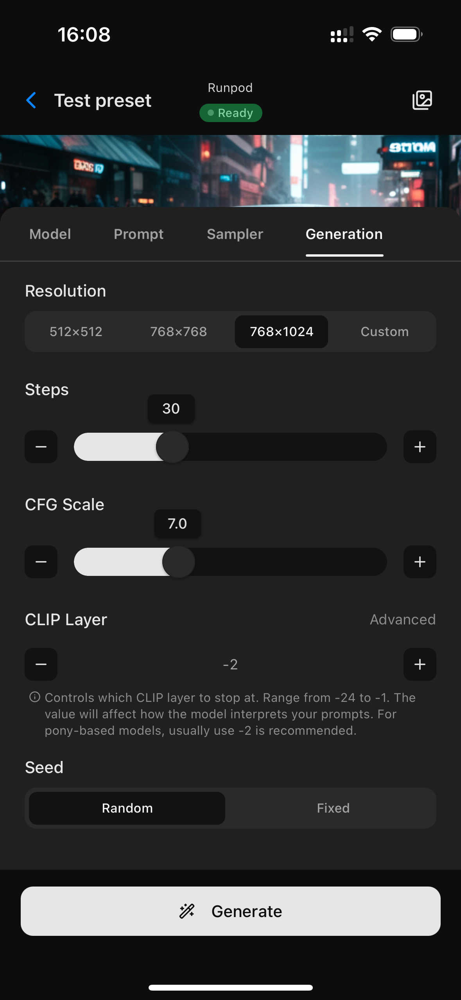
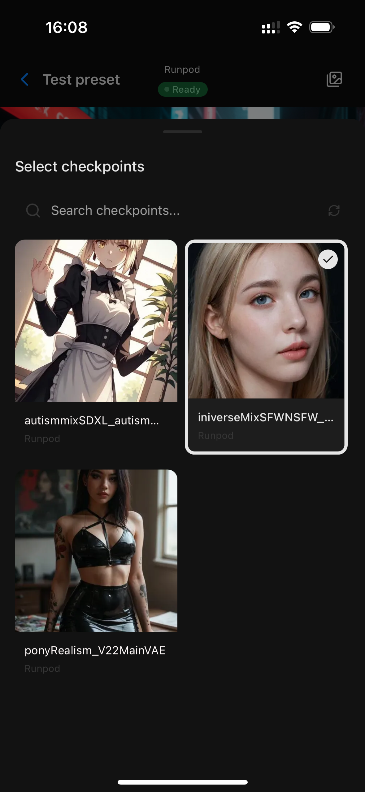
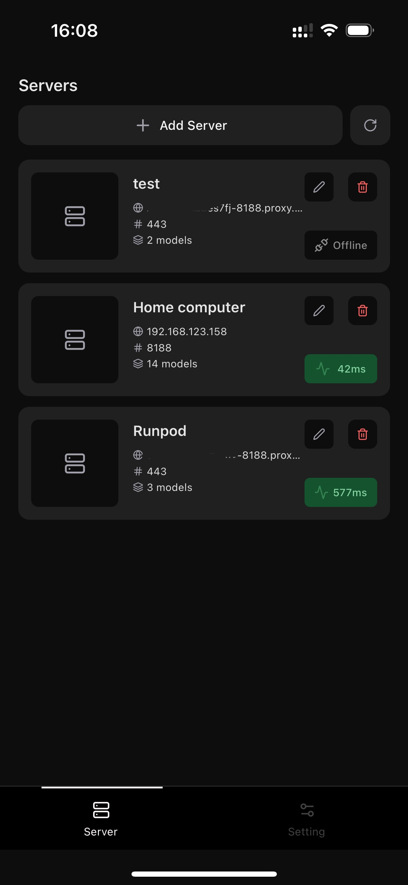

# Comfy Portal


[](https://apps.apple.com/us/app/comfy-portal/id6741044736)
[](https://apps.apple.com/us/app/comfy-portal/id6741044736)
[](https://apps.apple.com/us/app/comfy-portal/id6741044736)
[](LICENSE)

Comfy Portal is a modern iOS client application built with React Native for ComfyUI. It enables users to interact with ComfyUI servers directly from their iOS devices, making AI image generation more accessible and portable.

> **Note**: This is a third-party client for ComfyUI and is not officially affiliated with the ComfyUI project.

## Features

- 📱 Native iOS interface optimized for mobile
- 🔄 Real-time workflow monitoring and control
- 🎨 Intuitive preset management
- 🔌 Seamless connection to ComfyUI instances
- 🛡️ Local-first approach with data privacy
- 📊 Resource usage monitoring
- 🌙 Dark mode support

## Screenshots

<div style="display: flex; flex-wrap: wrap; gap: 10px; justify-content: center;">
    
    
    
    
    
</div>

## Installation

### App Store (Recommended)

[](https://apps.apple.com/us/app/comfy-portal/id6741044736)

### Build from Source

> **Important**: Building from source is for personal use only. Redistribution or commercial use of modified versions is not permitted. Please see the [LICENSE](LICENSE) file for details.

#### Prerequisites

- macOS with Xcode 15.0+
- Node.js 18.0+
- iOS Development environment set up
- CocoaPods installed
- Physical iOS device or simulator (iOS 15.1+)

#### Build Steps

1. Clone the repository:

```bash
git clone https://github.com/ShunL12324/comfy-portal.git
cd comfy-portal
```

2. Install dependencies:

```bash
npx expo install
```

3. Build and run on iOS device:

```bash
npx expo run:ios -d
```

Note: The built app is for personal use only. You may not redistribute the app or create modified versions for commercial use.

## Server Setup Guides

We provide detailed guides for setting up your ComfyUI server:

- [Local Server Setup](https://shunl12324.github.io/comfy-portal/guide/local-server) - Run ComfyUI on your computer
- [Remote Server Setup](https://shunl12324.github.io/comfy-portal/guide/remote-server) - Host ComfyUI on a remote server
- [RunPod Server Setup](https://shunl12324.github.io/comfy-portal/guide/remote-server-runpod) - Deploy ComfyUI on RunPod
- [Getting Workflow JSON](https://shunl12324.github.io/comfy-portal/guide/workflow-json) - Export workflows from ComfyUI in API format

## Key Features

### Flexible Server Management

- Connect to multiple ComfyUI servers seamlessly
- Support both local network (home computer) and cloud-based servers
- Easy server addition and switching
- Monitor server status in real-time

### Remote Generation Control

- Control image generation through your ComfyUI server
- Adjust generation parameters on the go
- Select and switch between different base models
- Built-in LoRa model support and management

### Remote Access & Control

- Control your ComfyUI instance from anywhere
- Real-time generation monitoring
- View results instantly on your device
- Save and share generated images directly

## Version

Current Version: 1.0.0

## Requirements

- iOS 15.1 or later
- iPhone only (iPad support coming soon)
- Access to a ComfyUI server (local or remote)

## Roadmap

We're actively working on new features to make Comfy Portal even better:

### Coming Soon

- 📥 **Model Management**
  - Direct model downloads from within the app
  - Model version tracking
  - Storage optimization
- 🔄 **Server Workflow Sync**
  - Bi-directional workflow synchronization
  - Cloud backup and restore
  - Cross-device workflow sharing

## Technology Stack

- **Framework**: [Expo](https://expo.dev) with React Native
- **UI Components**: [Gluestack UI v2](https://gluestack.io)
- **Styling**: [NativeWind](https://www.nativewind.dev)
- **Animations**: [Moti](https://moti.fyi)
- **Icons**: [Lucide React Native](https://lucide.dev)
- **Language**: TypeScript
- **Build System**: EAS Build

## Security & Privacy

- All data is stored locally on your device
- No data is collected or transmitted except for server connections
- Server connections are made directly to your specified ComfyUI instances
- No analytics or tracking implemented
- Photo library access is only used for saving generated images

## License

This project uses a Source Available license. The source code is publicly available for personal and educational use, while commercial usage requires proper licensing.

### License Terms

- **Personal & Educational Use**: Free for:

  - Personal projects
  - Learning and studying
  - Academic research
  - Testing and evaluation

- **Commercial Use**:
  - Requires proper licensing
  - Contact for commercial opportunities

For detailed terms and conditions, please see the [LICENSE](LICENSE) file.

## Legal

- [Privacy Policy](https://shunl12324.github.io/comfy-portal/privacy)
- [Terms of Service](https://shunl12324.github.io/comfy-portal/terms)

## Support & Contact

For support, bug reports, or commercial inquiries:

- Email: liushun0574@gmail.com
- GitHub Issues: [Open an issue](https://github.com/ShunL12324/comfy-portal/issues)

## Acknowledgments

Special thanks to the [ComfyUI](https://github.com/comfyanonymous/ComfyUI) team for creating the amazing project that made this client possible.
