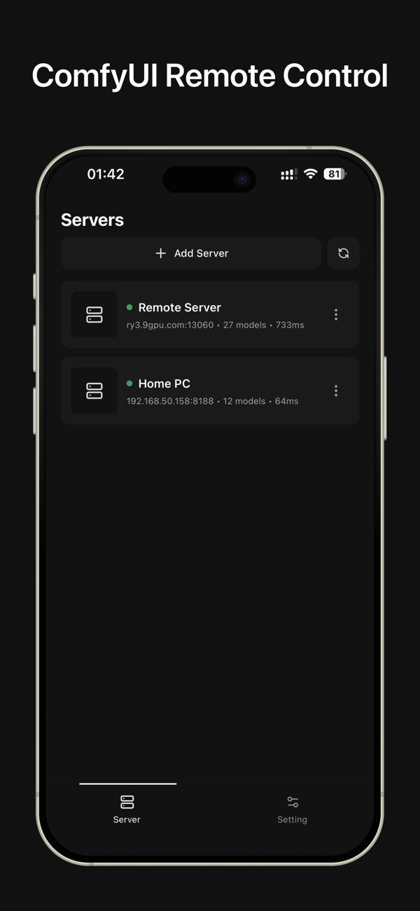
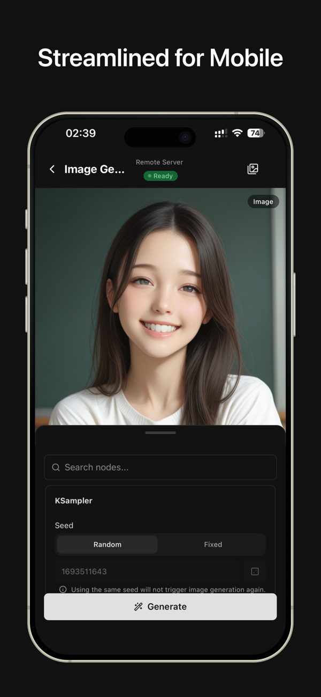
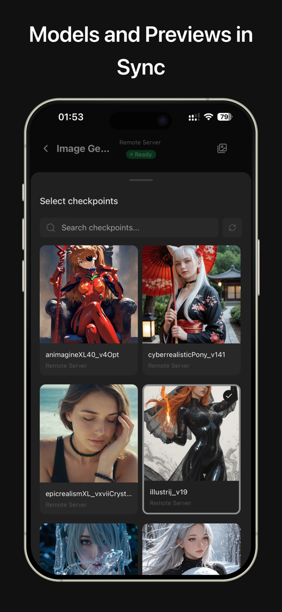
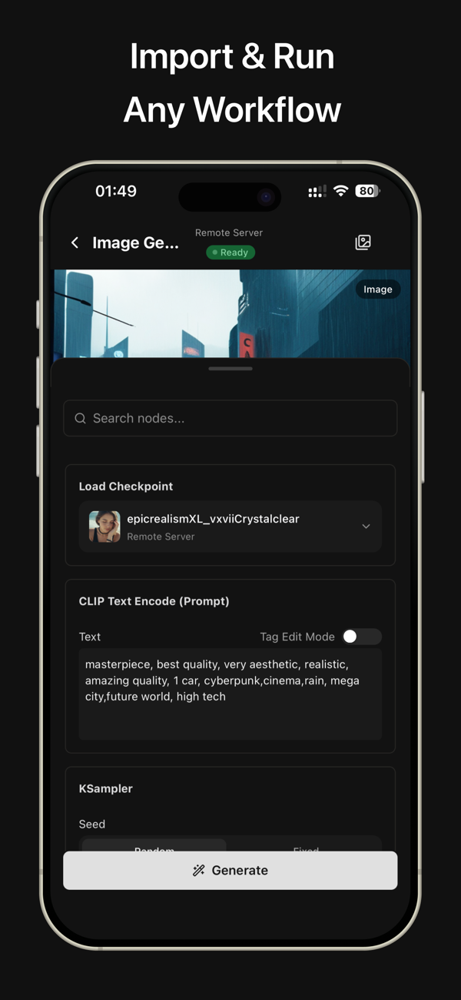
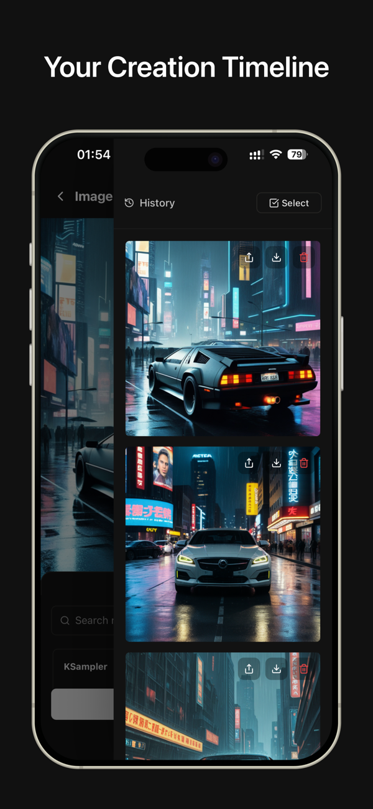
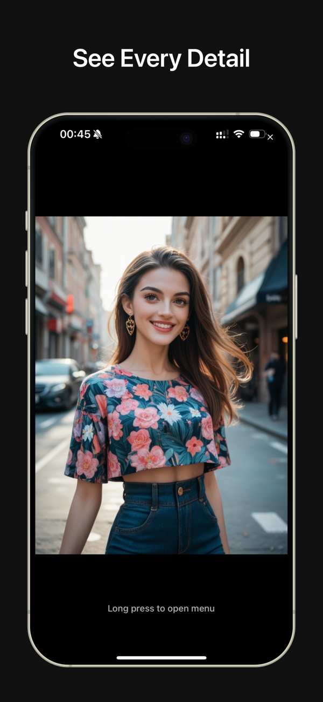

# Comfy Portal

<div align="center">
  

  <h3>Your Native iOS & Android Companion for ComfyUI</h3>

  <p>
    <a href="https://apps.apple.com/us/app/comfy-portal/id6741044736">
      
    </a>
    <a href="https://play.google.com/store/apps/details?id=com.sillyl12324.comfyportal">
      
    </a>
    <a href="https://github.com/ShunL12324/comfy-portal/actions/workflows/testflight.yml">
      
    </a>
    <a href="https://github.com/ShunL12324/comfy-portal/actions/workflows/google-play.yml">
      
    </a>
    
    <a href="https://github.com/ShunL12324/comfy-portal/stargazers">
      
    </a>
    <a href="https://github.com/ShunL12324/comfy-portal/issues">
      
    </a>
    <a href="LICENSE">
      
    </a>
  </p>
</div>

---

**Comfy Portal** is a professional, native iOS & Android client designed for [ComfyUI](https://github.com/comfyanonymous/ComfyUI). It bridges the gap between desktop power and mobile convenience, offering a seamless experience for AI artists and developers.

> **Note**: This is an unofficial client and is not affiliated with the ComfyUI project.

## Features

| Feature | Description |
| :--- | :--- |
| **Native Experience** | Built with React Native and Expo for a smooth, responsive iOS feel. |
| **Real-time Monitor** | Watch generation progress step-by-step and preview images instantly. |
| **Seamless Connect** | Connect to local (LAN) or remote (Cloud/RunPod) ComfyUI instances. |
| **Workflow Manager** | View, manage, and execute your complex workflows on the go. |
| **Privacy First** | Direct connection to your server. No data is stored on our cloud. |

## Interface

<div align="center">
  
  
  
  <br>
  
  
  
</div>

## Latest Updates

| Version | Date | Changes |
| :--- | :--- | :--- |
| **v1.0.5** | 2025-02-08 | • **Feature**: AI-powered prompt enhancement for text-to-image workflows<br>• **Feature**: GetImageSize node support<br>• **Improvement**: LoadImage node with image preview and multiple source options<br>• **Improvement**: Workflow tab UI and empty states<br>• **Fix**: Dark mode flash on app launch<br>• **Fix**: Keyboard handling in modals and text inputs<br>• **Upgrade**: Expo SDK 55 with React Native 0.83 |
| **v1.0.4** | 2025-12-01 | • **Documentation**: Migrated to VitePress<br>• **Feature**: Smooth upload progress & cancellation<br>• **Fix**: Video preview issues resolved<br>• **Docs**: Added extension recommendation |

## Quick Start

### 1. Download App
Get the latest version directly from the App Store.

<a href="https://apps.apple.com/us/app/comfy-portal/id6741044736">
  
</a>

### 2. Setup Server
You need a running ComfyUI instance. We provide detailed guides for various setups:

| Environment | Guide |
| :--- | :--- |
| **Local** | [Local Server Setup](https://shunl12324.github.io/comfy-portal/guide/local-server) |
| **Remote** | [Remote Server Setup](https://shunl12324.github.io/comfy-portal/guide/remote-server) |
| **RunPod** | [RunPod Deployment](https://shunl12324.github.io/comfy-portal/guide/remote-server-runpod) |

### 3. Install Extension (Recommended)

To unlock full functionality, including **workflow synchronization** and enhanced app integration, we strongly recommend installing the [Comfy Portal Endpoint](https://github.com/ShunL12324/comfy-portal-endpoint) extension.

- **Workflow Sync**: Seamlessly sync your workflows from PC to App.
- **Enhanced Integration**: Provides necessary API endpoints for better app performance.

[Install Comfy Portal Endpoint →](https://github.com/ShunL12324/comfy-portal-endpoint)

## Development

### Prerequisites
- macOS with Xcode 15.0+
- Node.js 18+
- pnpm 8+
- CocoaPods

### Build Steps

1. **Clone the repository**
   ```bash
   git clone https://github.com/ShunL12324/comfy-portal.git
   cd comfy-portal
   ```

2. **Install dependencies**
   ```bash
   pnpm install
   ```

3. **Run on iOS Simulator/Device**
   ```bash
   npx expo run:ios
   ```

## License
This project is available for **personal and educational use**. Commercial usage requires a separate license. See [LICENSE](LICENSE) for details.

## Contributing
Contributions are welcome! Please feel free to submit a Pull Request.

## Star History

<div align="center">
  <a href="https://star-history.com/#ShunL12324/comfy-portal&Date">
    <picture>
      <source media="(prefers-color-scheme: dark)" srcset="https://api.star-history.com/svg?repos=ShunL12324/comfy-portal&type=Date&theme=dark" />
      <source media="(prefers-color-scheme: light)" srcset="https://api.star-history.com/svg?repos=ShunL12324/comfy-portal&type=Date" />
      
    </picture>
  </a>
</div>

---
<div align="center">
  <sub>Built with ❤️ by <a href="https://github.com/ShunL12324">Shun</a></sub>
</div>
