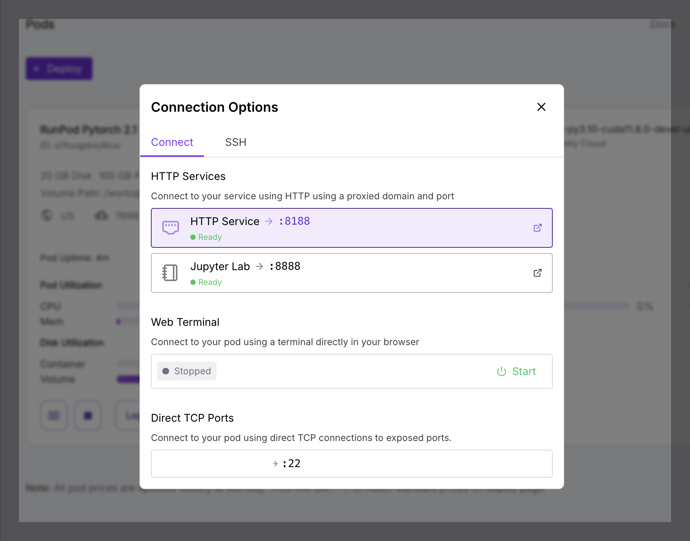

## 1. Configure RunPod Template

When deploying your pod, make these important configurations:

- Click "Edit Template" during deployment
- Find "Expose HTTP Ports" section
- Add port 8188 (ComfyUI's default port)

For detailed port configuration instructions, see:
[RunPod Port Configuration Guide →](https://docs.runpod.io/pods/configuration/expose-ports)

## 2. Start ComfyUI

You can either start ComfyUI manually or use our automated setup script.

### Option A: Automated Setup (Recommended)

Run this command in your pod's terminal to automatically set up and start ComfyUI(Please note run this command in your volume directory, usually mount to /workspace):

```bash
bash <(curl -s https://raw.githubusercontent.com/ShunL12324/comfy-portal/main/repo-assets/server-setup-RunPod.sh)
```

### Option B: Manual Setup

After your pod is running, start ComfyUI with network access enabled:

```bash
python main.py --listen 0.0.0.0 --port 8188
```

You can verify the HTTP service status and get your connection URL:

- Go to your pod's management page
- Click "Connect" button
- Under "HTTP Services", you should see port :8188 marked as "Ready"



## 3. Connect to the Server

Once ComfyUI is running, tap the "+" button to add the server:

- Name: Give your pod a memorable name (e.g., "RunPod Server")
- Host: Your pod's proxy URL (do not include https:// prefix)
- Port: 443 (RunPod proxy uses HTTPS port)

::: info Port Configuration
Although ComfyUI runs on port 8188, we use port 443 because RunPod proxies the connection through HTTPS.
:::

**Example Configuration:**

| Field | Value |
| :--- | :--- |
| **Name** | RunPod ComfyUI |
| **Host** | `****abc-8188.proxy.runpod.net` |
| **Port** | `443` |
