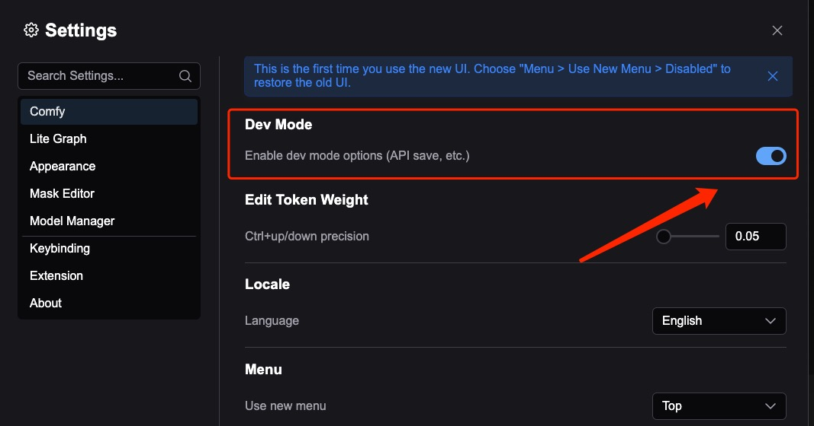
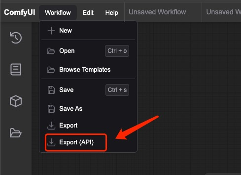

# Getting Workflow JSON in API Format

To import workflows into Comfy Portal, you'll need to export them from ComfyUI in API format. Here's how to do it:

## Step 1: Enable Developer Mode

1. Open ComfyUI in your browser
2. Click the settings button in the bottom left corner
3. Under "Comfy" section, find "Dev mode" and enable it

## Step 2: Export the Workflow

1. Open the workflow you want to export
2. Click the menu button in the top left corner
3. Go to "Workflow" > "Export(API)"
4. The JSON file will be automatically downloaded

## Step 3: Import to Comfy Portal

You have two options to import the workflow:

1. **Import File**: Import the downloaded JSON file directly into the app
2. **Import from Clipboard**: Copy all the content from the JSON file to your phone's clipboard, then use the "Import from Clipboard" option in the app

## Tips

- Make sure the workflow is working correctly in ComfyUI before exporting
- The API format JSON contains all necessary node configurations and connections
- This format is different from the regular workflow export format, make sure to use the "Export(API)" option
