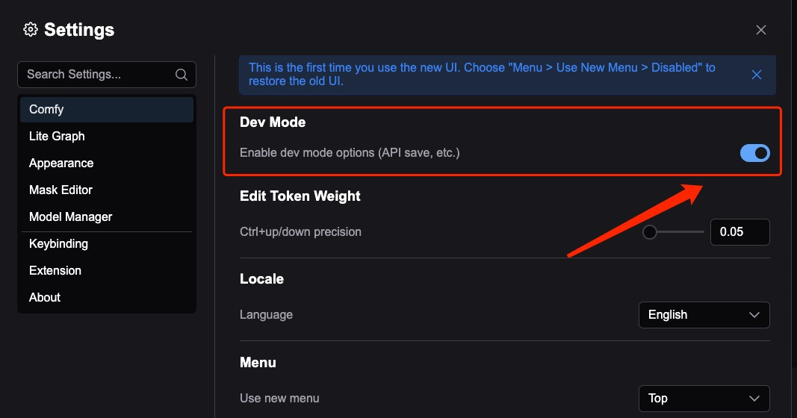
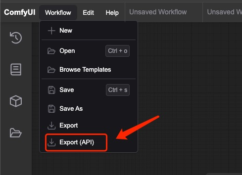

# 获取工作流的 API 格式 JSON

要将工作流导入到 Comfy Portal，你需要从 ComfyUI 导出 API 格式的工作流。以下是具体步骤：

## 步骤 1：启用开发者模式

1. 在浏览器中打开 ComfyUI
2. 点击左下角的设置按钮
3. 在 "Comfy" 部分找到 "Dev mode" 并启用

## 步骤 2：导出工作流

1. 打开你想要导出的工作流
2. 点击左上角的菜单按钮
3. 选择 "Workflow" > "Export(API)"
4. JSON 文件将自动下载

## 步骤 3：导入到 Comfy Portal

你有两种导入方式：

1. **导入文件**：直接将下载的 JSON 文件导入到应用中
2. **从剪贴板导入**：将 JSON 文件的所有内容复制到手机剪贴板，然后使用应用中的"从剪贴板导入"选项

## 提示

- 在导出之前，请确保工作流在 ComfyUI 中运行正常
- API 格式的 JSON 包含所有必要的节点配置和连接信息
- 这种格式与普通的工作流导出格式不同，请确保使用 "Export(API)" 选项
